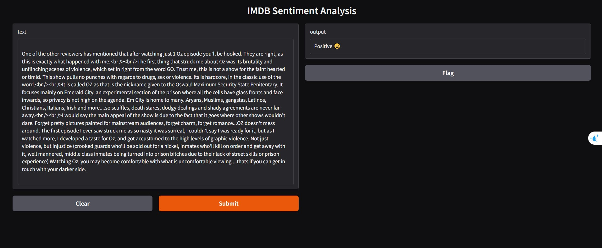

# 🎬 Final Project ITI: Sentiment Analysis on IMDB Movie Reviews 📊

## 📌 Description
This project is a **Sentiment Analysis** model built using **Deep Learning** and **Natural Language Processing (NLP)**.  
It classifies IMDB movie reviews as either **Positive 😀** or **Negative 😡**.  

The project demonstrates:
- Text preprocessing  
- Feature extraction (**TF-IDF / Word Embeddings**)  
- Training a **Neural Network using TensorFlow/Keras**  

---

## 🎯 Objective
- Build a deep learning model that classifies IMDB movie reviews (positive/negative).  
- Apply text preprocessing (cleaning, stopwords removal, stemming, lemmatization).  
- Compare feature extraction methods (**TF-IDF vs Embeddings**).  
- Train and evaluate a neural network for sentiment classification.  

---

## 📂 Dataset
- **Source:** [IMDB 50K Movie Reviews Dataset](https://www.kaggle.com/datasets/lakshmi25npathi/imdb-dataset-of-50k-movie-reviews)  
- **Description:** 50,000 balanced movie reviews labeled as **positive** or **negative**.  

---

## 🔎 Project Workflow
1. **Data Loading & Exploration**  
   - Checked dataset balance between positive and negative reviews.  
   - Analyzed review length distribution.  

2. **Text Preprocessing**  
   - Converted text to lowercase.  
   - Removed HTML tags, punctuation, and extra spaces.  
   - Tokenization (splitting text into words).  
   - Removed stopwords.  
   - Applied stemming & lemmatization.  

3. **Text Representation**  
   - Applied **TF-IDF Vectorization**.  
   - Experimented with **Word Embeddings** (Keras `TextVectorization` layer).  

4. **Model Building & Training**  
   - Built a simple Neural Network with:  
     - Embedding → Flatten → Dense Layers  
   - Trained on processed data.  

5. **Evaluation**  
   - Evaluated accuracy on test set.  
   - Compared preprocessing pipelines (generic vs IMDB-specific).  

---

## 📊 Results
- **Model Accuracy:** ~88% on test set 🎯  
- **TF-IDF** performed well, but **Embeddings + Dense Network** achieved the best results.  
- Preprocessing significantly improved model performance.  

### 🔥 Sample Visualizations  
Positive WordCloud:  
  

Negative Matrix:  
  

---

## ⚙️ How to Run

### 1. Clone this repository:
```bash
git clone https://github.com/YourUsername/Sentiment-Analysis-IMDB.git
cd Sentiment-Analysis-IMDB
